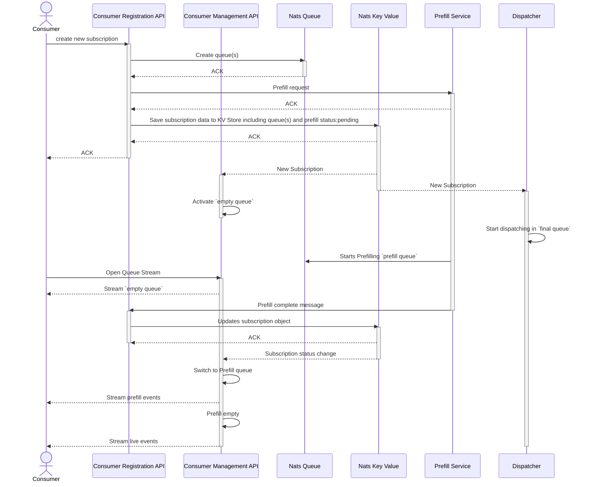
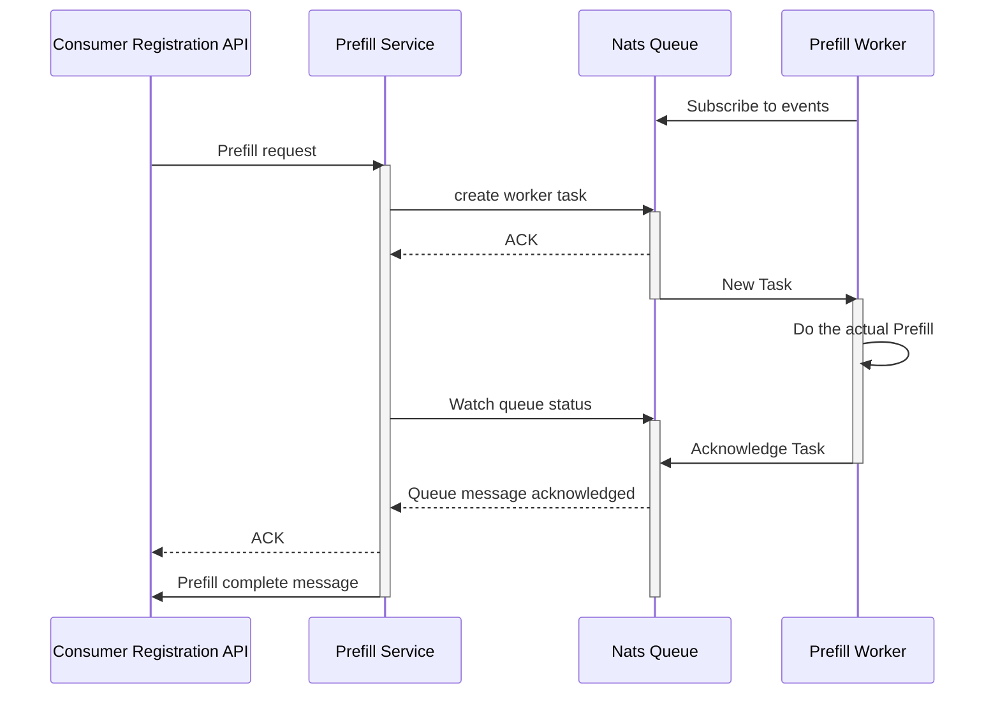
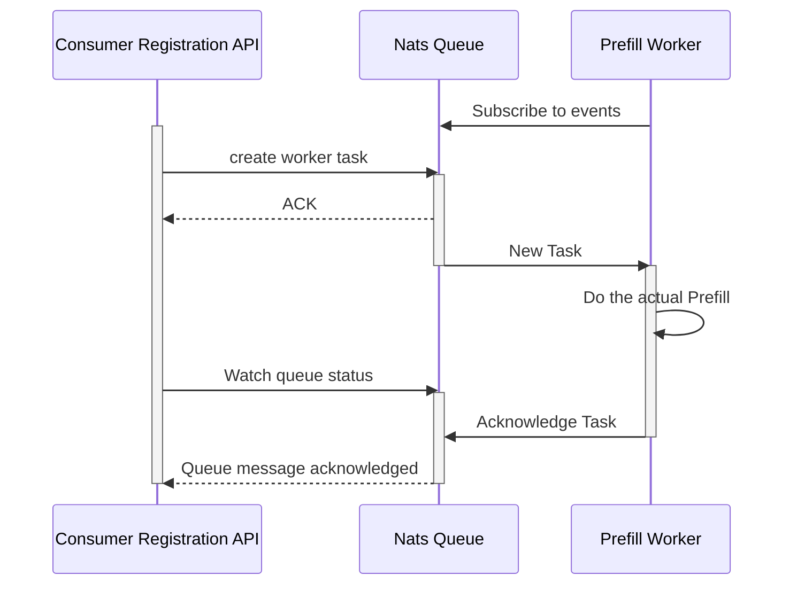
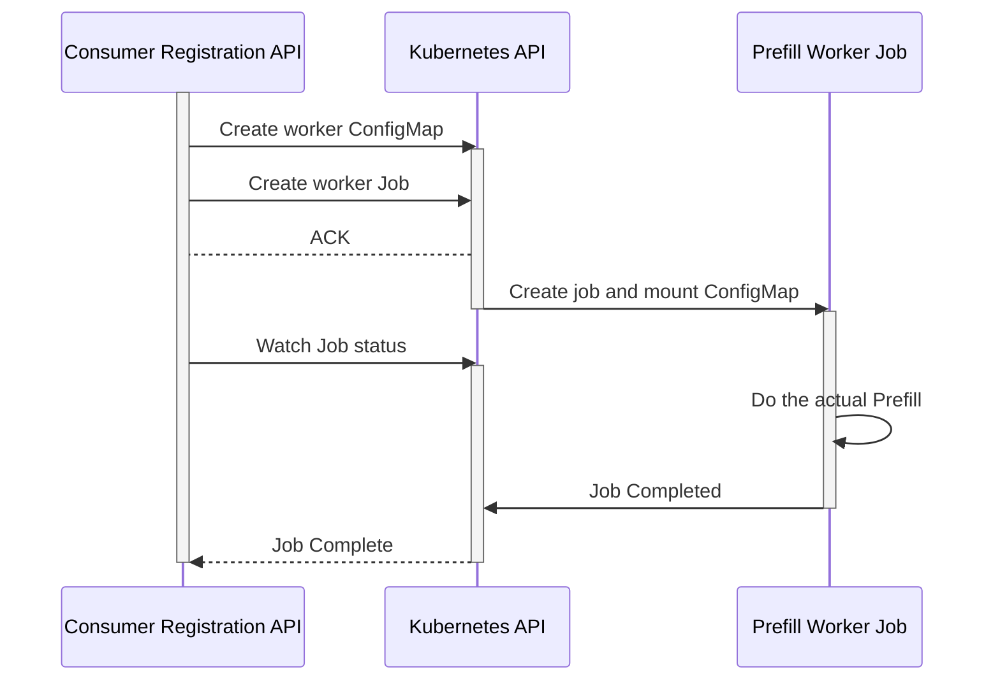

## Consumer Registration Flow

## Prefill Flow

## Simplified Prefill Flow

The PrefillService ist just proxying requests. Yes it encapsulates the Prefill process but we distribute the Registration Orchestration across separate components.

In this simplified version
all Provisioning Orchestration is consolidated into one service.
This makes it easier to develop and debug.
The functionality can still be encapsulated into it's own module including Ports and Adapters.

## Prefill Flow Utilizing Kubernetes Jobs

### TLDR

We can use the operator pattern to accomplish prefill tasks as long as we don't use CRD's (which we don't need anyway)

### Intro

The kubernetes operator pattern:
an `operator` pod manages other kubernetes resources by interacting with the kubernetes api for inside the cluster.

Operators frequently need two things:
- RoleBinding to have read and write access to specific kubernetes object types.
- Custom Resource Definition (CRD) extend the kubernetes api with custom Objects.
These are frequently used to define the desired state that the operator should configure (Give me a 5 node Postgres cluster)

Our understanding was, that this is not allowed in the `openDesk` context.
Thorsten Rossner and Dominik Kaminski clarified this misconception:

The main `openDesk` requirement is: "everything needs to be installable in namespaces"
- RoleBindings are namespace-specific (ClusterRoleBindings are the same but with cluster-scope)
- CRD's are always cluster-scoped **and thus forbidden in the openDesk context**

### Advantages

- Prefill containers are only running when needed
- Kubernetes takes care of retries, exponential backoff...
- What's happening is transparent to the user (Via the kubernetes API)
- Each prefill job gets it's own container
- There are no long-running HTTP API or Daemon processes associated with Prefill.
Instead most of the complexity is moved to the Kubernetes API
and a bit is moved to the Consumer Registration API
- Job status is persisted in the Kubernetes API. All components can crash to their heart's content.
- Once we have implemented the operator pattern, we can extend it to:
    - Scaling up UDM and LDAP containers in preparation for a prefill event
    - Kubernetes Objects defining consumers instead of http request to Consumer Registration API (CRD)

