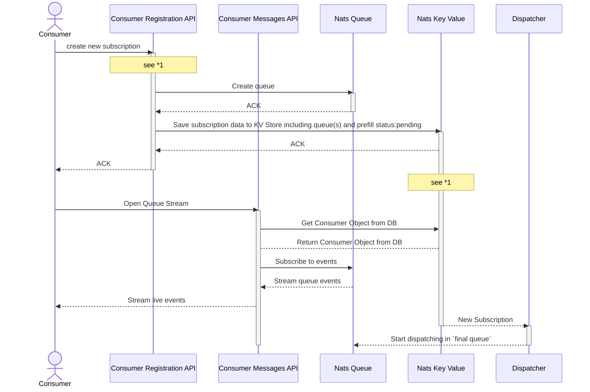
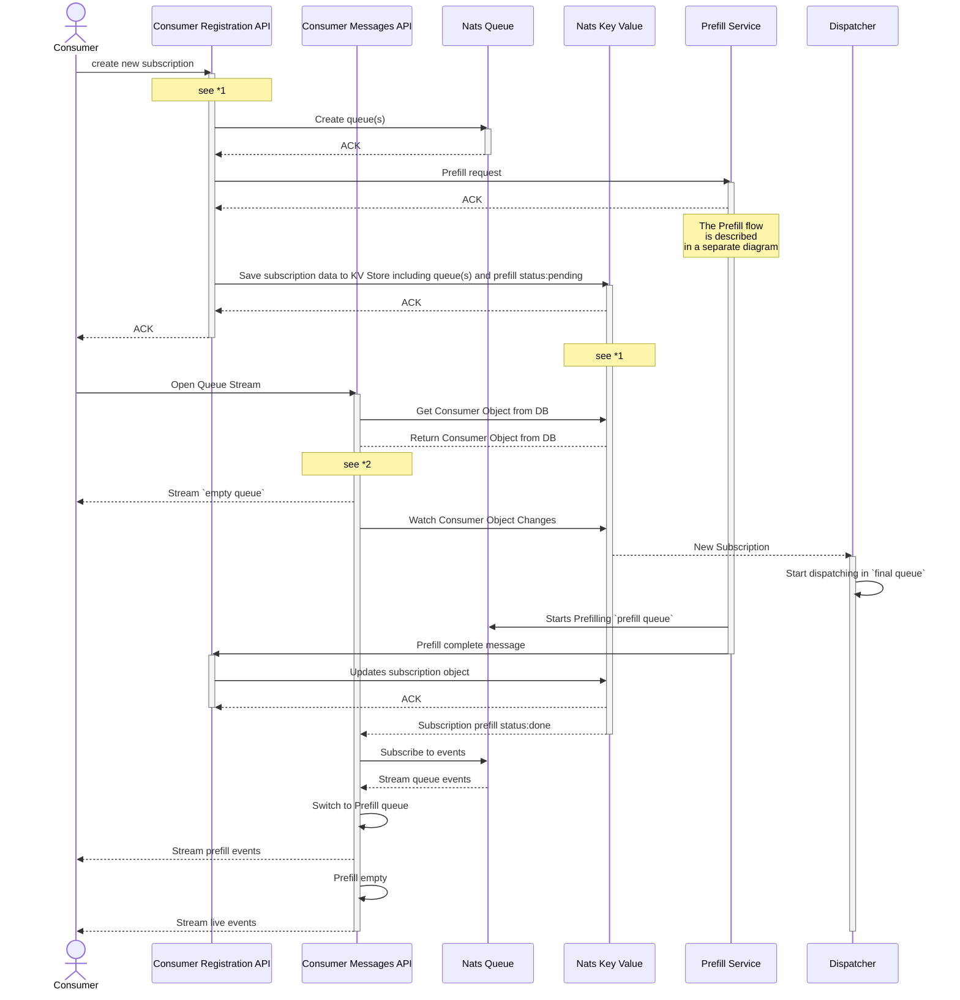
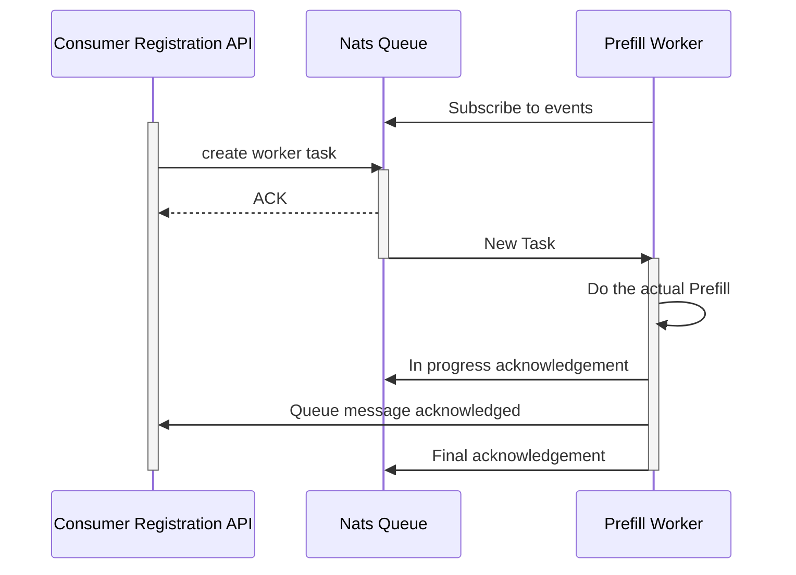
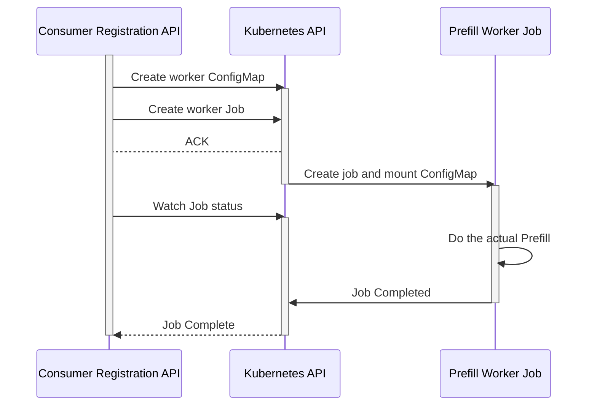

## Consumer Registration Flow

### Without Prefill

### With Prefill

All necessary data about consumers is persisted in the `Nats` key-value store. The Consumer Registration API has write-access to it while the Consumer Management API has read-access.

*1 No prefill for this example. What happens if a new Consumer is written to the key-value store, but no queues have been created yet. Currently the queue is created when the first message is sent by the dispatcher.
Solutions:
- The create new subscription request is only answered with a 200 OK if the needed queue(s) have been created and object has been persisted into the KV Store.
If any of this failed, the request has to be retried
- The ConsumerManagementAPI needs to retry for a bit and then fail if no queues are there. The Queue might be uninitialized until it's first message, which is an undefined time span.

*2 The Prefill queue needs to be blocked. It should appear to the consumer as if the queue is empty. No matter how the queues are managed in the background.

## Simplified Prefill Flow

We decided to implement the "Simplified Prefill" as a first step.

It's advantages are:
- Simpler to develop
- Simpler to debug
- Less risky compared to the Kubernetes Operator solution.
-

`create worker task` means that the Consumer Registration API creates a new task message in a dedicated Prefill Worker queue.
This persists the prefill request and enables automatic retries.

## Prefill Flow Utilizing Kubernetes Jobs

### TLDR

We can use the operator pattern to accomplish prefill tasks as long as we don't use CRD's (which we don't need anyway)

### Intro

The Kubernetes operator pattern:
an `operator` pod manages other Kubernetes resources by interacting with the Kubernetes API for inside the cluster.

Operators frequently need two things:
- RoleBinding to have read and write access to specific Kubernetes object types.
- Custom Resource Definition (CRD) extend the Kubernetes API with custom Objects.
These are frequently used to define the desired state that the operator should configure (Give me a 5 node PostgreSQL cluster)

Our understanding was, that this is not allowed in the `openDesk` context.
`Thorsten Rossner` and `Dominik Kaminski` clarified this misconception:

The main `openDesk` requirement is: "everything needs to be installed in one namespace"
- RoleBindings are namespace-specific (ClusterRoleBindings are the same but with cluster-scope)
- CRD's are always cluster-scoped **and thus forbidden in the openDesk context**

### Advantages

- Prefill containers are only running when needed
- Kubernetes takes care of retries, exponential back-off...
- What's happening is transparent to the user (Via the Kubernetes API)
- Each prefill job gets it's own container
- There are no long-running HTTP API or Daemon processes associated with Prefill.
Instead most of the complexity is moved to the Kubernetes API
and a bit is moved to the Consumer Registration API
- Job status is persisted in the Kubernetes API. All components can crash to their heart's content.
- Once we have implemented the operator pattern, we can extend it to:
    - Scaling up UDM and LDAP containers in preparation for a prefill event
    - Kubernetes Objects defining consumers instead of http request to Consumer Registration API (CRD)

