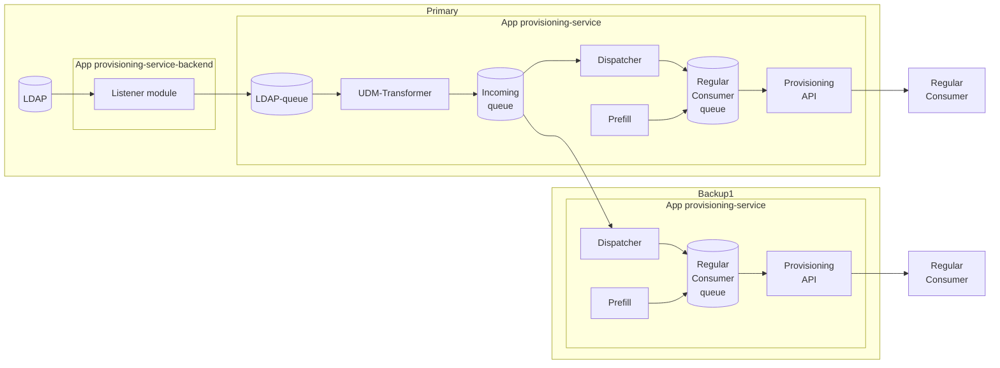

# Overview
The provisioning service on UCS systems consists of two apps:
 - `provisioning-service-backend`: This app install a listener module to capture the LDAP changes and push writes them to LDAP-queue.  
This app is only installed on the primary system.
 - `provisioning-service`: This app contains the main provisioning service components, udm-transformer, prefill, dispatcher, and provisioning API.

## Architecture diagram
The following diagram illustrates the architecture of the provisioning service on UCS systems with primary and backup components.

## Differences to N4K Provisioning Service
There is few differences between the implementation on UCS against N4K:
 - On UCS, the dispatcher on backups need to read from the incoming queue on the primary.  
In N4K, there is just one instance of the dispatcher and backups don't exist.
 - Due to the previous difference, on UCS, the incoming queue requires to use the retention policy `INTEREST` to allow multiple consumers getting the same messages.  
In N4K, the incoming queue uses the default retention policy `WORKQUEUE` as there is only one consumer (the dispatcher).
 - On UCS, the udm-transformer has the whole univention python library mounted as a volume.