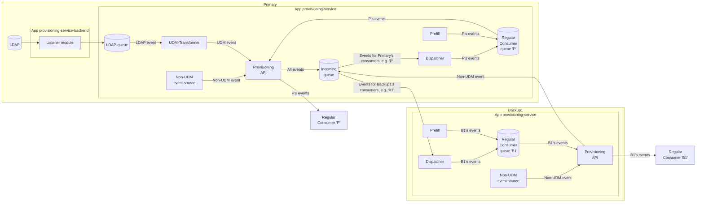
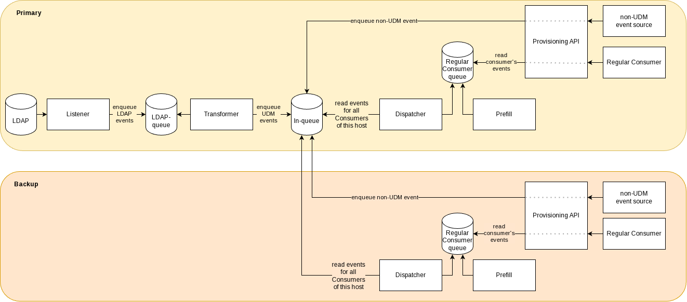

# Overview

The provisioning service on UCS systems consists of two apps:

- `provisioning-service-backend`: This app installs a listener module that captures LDAP changes
   and writes them to the LDAP-queue. This app is only installed on the Primary Directory Node.
- `provisioning-service`: This app contains the main provisioning service components:
   udm-transformer, prefill, dispatcher, and provisioning API and is installed on the Primary and
   on all Backups.

## Architecture diagram

The following diagram illustrates the data flow in the architecture of the Provisioning Service on UCS systems with
Primary and Backup nodes.

Note that LDAP/UDM changes originate always and only from the Primary's LDAP server.
But other (non-UDM) events can be created anywhere and can be enqueued using any *Provisioning API* instance.
Those events may have to be distributed to other UCS nodes.
Thus, the *Provisioning API* instances on Backup nodes connect to two NATS instances:

- The NATS on their node for the queues of "their" Consumers.
- The NATS on the Primary for enqueuing the non-UDM events they received.

This way the non-UDM events can be pulled by the *Dispatchers* of all nodes.

Alternative drawing:

## Differences to N4K Provisioning Service

There are a few differences between the implementation on UCS and N4K:

- On UCS, the dispatcher of each backup needs to read from the incoming queue of the primary. In
  N4K, there is just one instance of the dispatcher and backups don't exist.
- Due to that difference, on UCS, the incoming queue is required to use the retention
  policy `INTEREST` to allow multiple consumers getting the same messages.
  In N4K, the incoming queue uses the default retention policy `WORKQUEUE` as there is only one
  consumer (the dispatcher).
